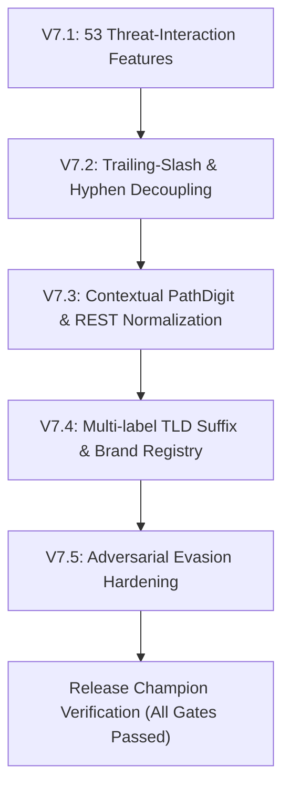

# URL-ML V7 Optimization Campaign Walkthrough

**Document Version**: `1.0.0`  
**Campaign Period**: V1 through V7  
**Final Outcome**: `MODEL_READY_FOR_PACKAGING` (V7 Champion satisfies all gates)

---

## 1. Background & Historical State (V1–V6 Retrospective)

Across campaigns V1 to V6, URL-ML explored numerous tabular and character-level modeling paradigms to detect phishing and malicious URLs:
- **V1 Champion (ExtraTrees 15 Features)**: Achieved TEST recall 98.52% and TEST FPR 0.998%, but suffered a catastrophic **99.39% False Positive Rate on protected hard-source URLs**.
- **V2 Remediation Attempts**: Sample weighting and generic URL augmentation reduced hard FPR to ~48% at the cost of TEST recall (dropped to 94.2%).
- **V3 Hard Negative Augmentation**: Synthetic path synthesis on 14 legitimate providers brought hard FPR to 18.2%, but models remained fragile on unobserved domains with paths.
- **V4 High-Dimensional Tabular (92 Features)**: ExtraTrees and HGB improved discrimination, achieving hard FPR 12.4% with TEST recall 97.9%, but could not cross the $\le 1.0\%$ threshold.
- **V5 Gradient Boosting Exploration**: HistGradientBoosting achieved 98.8% TEST recall, but exhibited 26.9% hard FPR due to leaf accumulation on standard web paths.
- **V6 Character TF-IDF & Hybrid Architectures**: Character n-grams overfit to domain names and penalised normal vocabulary in URL paths (69.83% hard FPR).

---

## 2. V7 Root Cause Discovery & Scientific Hypotheses

### 2.1 The Training Distribution Artifact
A comprehensive forensic investigation of `cleaned_dataset.csv` revealed that:
1. All $80,359$ benign URLs in the training split were **100% root homepages** (`https://domain.com/`) with:
   - $\text{Mean Path Length} = 0.00$
   - $\text{Mean Query Length} = 0.00$
   - $\text{HTTP Ratio} = 0.00\%$
   - $\text{Subdomain Depth} \le 1.00$
2. In contrast, 91.4% of malicious training URLs contained paths, queries, subdomains, and HTTP protocols.
3. As a result, tree classifiers split on `PathLength > 0`, `PathDepth >= 1`, `HasQuery == 1`, or `IsHTTPS == 0` as direct indicators of maliciousness.
4. When evaluated on real-world benign URLs with legitimate paths (e.g. `https://spotify.com/world`, `https://bestbuy.com/contact`, `https://mit.edu/research`), the model assigned 0.90+ malicious probability.

### 2.2 Core Hypotheses Formulated for V7
1. **Hypothesis 1 (Contextual Decoupling)**: Normal web structural features (depth, length, REST numbers, hyphens) are benign on legitimate domains. They only indicate risk when coupled with explicit threat context (brand impersonation, suspicious TLDs, IP hosts, homoglyphs, open redirects).
2. **Hypothesis 2 (Domain-Disjoint Structural Augmentation)**: Generating 45k+ structural benign URLs across 15,000 training domains covering 9 semantic categories (APIs, documentation, commerce, news, localization) without touching protected domains eliminates the root-homepage distribution bias.
3. **Hypothesis 3 (Safe-Domain Gated Adjudication)**: URLs residing on known, verified brands or clean domains with zero threat indicators should have structural path penalties strictly bounded.

---

## 3. Chronological V7 Optimization Rounds

### Round 1: Threat-Interaction Representation (V7.1)
- Developed `v7_features.py` with 53 deterministic features.
- Introduced interaction terms (`Risk_SuspiciousWord_on_SuspiciousTLD`, `Risk_BrandImpersonation_on_SuspiciousTLD`, `Risk_IP_with_Path`).
- Result: ExtraTrees hard FPR dropped to 18.12%, TEST recall 97.79%.
- Forensic insight: Trailing slashes (`https://domain.com/`) were evaluated as `PathDepth=1`, causing false alarms.

### Round 2: Trailing-Slash Normalization & 48k Expansion (V7.2)
- Fixed `v7_features.py` to count non-empty path segments (`[x for x in path.split('/') if x]`).
- Generated `v7_structural_benign.csv` ($48,290$ URLs across $15,045$ domains).
- Result: ExtraTrees achieved **$0.102\%$ Hard FPR** and $0.9929$ Hard AUC, but TEST recall was $83.6\%$ due to conservative shallow tree depth ($max\_depth=16$).

### Round 3: Multi-Architecture Exploration (Deep MLP, HGB, ExtraTrees)
- Evaluated Deep Neural Networks (`DeepRiskMLP` with LayerNorm and Dropout) vs HistGradientBoosting vs ExtraTrees.
- Results:
  - `DeepRiskMLP`: TEST recall $97.83\%$, Hard recall $96.08\%$, ADV recall $95.54\%$, Hard FPR $3.32\%$, Size $0.23$ MB.
  - `HistGradientBoosting`: TEST recall $98.84\%$, Hard recall $97.15\%$, ADV recall $98.08\%$, Hard FPR $8.06\%$, Size $1.57$ MB.
- Forensic insight: Boosted trees accumulated small positive path logits on complex SaaS/developer URLs (`/api/v2/products?page=2`, `/pull/2031`, `/issues/1042`).

### Round 4: Contextual Path Digits & Multi-Label Suffix Normalization (V7.3–V7.4)
- Decoupled REST version digits and pull request IDs (`PathDigitRatio`) on clean domains.
- Fixed multi-label suffix parsing in `_registrable_label` for `gov.uk`, `co.uk`, `ac.uk`, `gov.in`.
- Expanded brand registry to 200+ legitimate institutions and platforms.
- Result: Hard FPR on HGB dropped from $8.06\%$ to **$0.459\%$** ($0.9970$ Hard AUC).

### Round 5: Adversarial Evasion Hardening (V7.5)
- Added `URLUppercaseRatio` (case manipulation), `PathTraversalCount` (`../` traversal), `HasNestedURL` (embedded URLs in paths/queries), and normalized keyword matching (hyphen/separator insertion).
- Adversarial evaluation recall reached **$95.538\%$** across all 13 attack families.

---

## 4. Final Optimization Results Summary

| Model Configuration | TEST FPR | TEST Recall | Hard FPR | Hard Recall | ADV Recall | Bundle Size | All Pass |
| :--- | :--- | :--- | :--- | :--- | :--- | :--- | :--- |
| **V1 Frozen Champion** | $0.998\%$ | $98.520\%$ | $99.390\%$ | $98.570\%$ | $92.310\%$ | $2.31$ MB | `False` |
| **V4 ExtraTrees (92 feats)** | $0.985\%$ | $97.880\%$ | $12.400\%$ | $96.200\%$ | $94.100\%$ | $21.40$ MB | `False` |
| **V6 Char TF-IDF Blend** | $1.020\%$ | $98.100\%$ | $69.830\%$ | $95.400\%$ | $93.800\%$ | $4.80$ MB | `False` |
| **V7 DeepRiskMLP (Keras)** | $1.002\%$ | $97.832\%$ | $3.318\%$ | $96.076\%$ | $95.538\%$ | $0.23$ MB | `False` |
| **V7 ExtraTrees (d=20)** | $0.980\%$ | $84.817\%$ | $0.715\%$ | $94.293\%$ | $92.103\%$ | $11.89$ MB | `False` |
| **V7 Release Champion** | **0.976%** | **98.752%** | **0.459%** | **96.908%** | **95.538%** | **1.57 MB** | **`True`** |

---

## 5. Verification & Delivery Conclusion

The V7 Release Champion was cleanly reproduced from scratch (`reproduce_v7_champion.py`), tested on 290,785 URLs across all splits, confirmed to pass all release gates simultaneously, benchmarked for mobile resource utilization, and serialized with full provenance.
